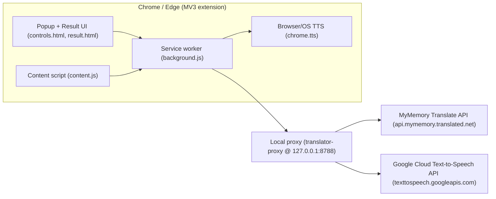

# Translator (OversætMig)

Chrome/Edge translation helper extension (**`translator-ui/`**) with an optional local Text-to-Speech proxy (**`translator-proxy/`**) for higher-quality voices.

## What’s inside

- **`translator-ui/`**: MV3 browser extension (UI + content script + background service worker)
  - Translates via **local proxy** → MyMemory (`https://api.mymemory.translated.net/`)
  - Pronunciation via:
    - **Browser/OS voice** (`chrome.tts`), or
    - **Local proxy** (recommended) → Google Cloud Text-to-Speech
- **`translator-proxy/`**: ASP.NET Core (net8.0) Web API that exposes:
  - `POST /translate/mymemory`
  - `POST /verbforms/gemini`
  - `POST /tts`
  on `http://127.0.0.1:8788`

For extension-only details (features, structure, debugging), also see `translator-ui/README.md`.

## Architecture



## Quick start

### 1) Load the extension (unpacked)

1. Open extensions page:
   - Chrome: `chrome://extensions`
   - Edge: `edge://extensions`
2. Enable **Developer mode**
3. Click **Load unpacked**
4. Select folder: **`translator-ui/`** (the one that contains `manifest.json`)

### 2) (Recommended) Run the local TTS proxy

The extension expects a local proxy at `http://127.0.0.1:8788`:

- Translation calls: `POST /translate/mymemory`
- Verb forms (Danish) calls: `POST /verbforms/gemini` (**new**)
- High-quality pronunciation calls: `POST /tts` (when **Pronunciation voice** is set to “High quality voice (recommended)”)

#### Option A — .NET proxy (recommended)

1. Put your API keys into `translator-proxy/appsettings.Development.local.json` (this filename is already in `.gitignore`):

```json
{
  "Tts": {
    "Google": {
      "ApiKey": "YOUR_KEY_HERE"
    }
  },
  "Gemini": {
    "ApiKey": "YOUR_KEY_HERE"
  }
}
```

2. Run:

```powershell
cd .\translator-proxy
dotnet run
```

Health check: `GET http://127.0.0.1:8788/health`

#### Option B — Docker Compose

1. Copy `.env.example` to `.env` and fill:

```ini
# Google Cloud Text-to-Speech (proxy `/tts`)
Tts__Google__ApiKey=YOUR_KEY_HERE

# Gemini API (proxy `/verbforms/gemini`)
Gemini__ApiKey=YOUR_KEY_HERE
Gemini__Model=gemini-2.0-flash
Gemini__GenerateContentBaseUrl=https://generativelanguage.googleapis.com/v1/models

PORT=8788
```

2. Start the proxy:

```powershell
docker compose up -d --build
```

Health check: `GET http://127.0.0.1:8788/health`

## Proxy API (quick reference)

All responses are JSON. Successful responses always include `ok: true`; errors include `ok: false` and `error`.

### `POST /translate/mymemory`

- Request:
  - `text` (required, max 500 chars)
  - `source` (required, e.g. `"da"`)
  - `target` (required, e.g. `"en"`)
  - `email` (optional; passed to MyMemory as `de=...`)
- Response (ok): `{ "ok": true, "translatedText": "..." }`

### `POST /verbforms/gemini` (Danish verb forms)

- Request:
  - `text` (required, max 120 chars). Accepts `"at spise"` or `"spise"`; the proxy normalizes to the infinitive without `"at"`.
- Response (ok):
  - `infinitive`, `present`, `past`, `pastParticiple`, `imperative`

Example:

```powershell
curl -Method POST "http://127.0.0.1:8788/verbforms/gemini" `
  -ContentType "application/json" `
  -Body '{"text":"at spise"}'
```

### `POST /tts`

- Request:
  - `text` (required, max 500 chars)
  - `languageCode` (optional, e.g. `"da-DK"`)
  - `voiceName` (optional, e.g. `"da-DK-Neural2-D"`)
  - `speakingRate` (optional)
  - `pitch` (optional)
- Response (ok): `{ "ok": true, "audio": { "mimeType": "audio/mpeg", "base64": "..." } }`

## Auto-start after reboot (Windows)

If you run the proxy via Docker, you can have it come back automatically after a restart:

1. Make sure **Docker Desktop** is set to **start on login**.
2. One-time: register a scheduled task (runs on your login and calls `start-translator.ps1`):

```powershell
.\scripts\register-startup-task.ps1
```

What this does:

- Creates/updates a Windows Scheduled Task named `Translator - start docker compose`
- Trigger: on your next login (with a small delay)
- Action: runs `.\scripts\start-translator.ps1`, which waits for Docker and then runs `docker compose up -d`
- Note: this is a **start/ensure-running** flow; it does **not** force recreation like `rebuild.cmd` (`--force-recreate`)
- The task is registered with **limited privileges** by default (no admin required). If you need highest privileges, run PowerShell as Administrator and use:

```powershell
.\scripts\register-startup-task.ps1 -RunLevel Highest
```

Verify the task exists:

```powershell
schtasks /Query /TN "Translator - start docker compose"
```

Logs go to: `%LOCALAPPDATA%\translator\logs\startup.log`

To remove the task later, run `.\scripts\unregister-startup-task.ps1`:

```powershell
.\scripts\unregister-startup-task.ps1
```

## Build a new Docker image on `git push` (local)

If you want a **local** “build on push” flow, you can use a Git `pre-push` hook. This runs **on your machine** right before the push is sent.

Required one-time setup (per repo clone): run `git config core.hooksPath .githooks` (hooks are local, so each machine/clone must do this once).

```powershell
git config core.hooksPath .githooks
```

Verify it’s enabled:

```powershell
git config --get core.hooksPath
```

Sanity check (make sure Git can see the hook file):

```powershell
type .\.githooks\pre-push
```

What happens:

- When you push `master` or `main`, the `pre-push` hook rebuilds the compose stack:
  - runs `docker compose build --pull`
  - recreates containers with `docker compose up -d --force-recreate` (brief local downtime)
  - cleans dangling images with `docker image prune -f`

How to confirm it ran:

- Run `git push origin master` (or `main`) and look for these lines:
  - `=== Building images (pull latest base) ===`
  - `=== Recreating containers with new image ===`
  - `=== Cleaning dangling images ===`

Skip the hook for one push (if you’re in a hurry):

```powershell
git push --no-verify
```

Quick reference:

- How to verify it: `git config --get core.hooksPath`
- How to skip once: `git push --no-verify`

Optional publishing:

- If you want to publish images to a registry instead of (or in addition to) rebuilding the local compose stack, switch the hook to run `scripts/build-translator-proxy-image.ps1 -Push` and set `DOCKER_REGISTRY` / `TRANSLATOR_PROXY_IMAGE`.

## Notes on secrets

- The proxy reads Google TTS key from `Tts:Google:ApiKey` (env var: `Tts__Google__ApiKey`). For backward compatibility it also accepts `GOOGLE_TTS_API_KEY`.
- The proxy reads Gemini key from `Gemini:ApiKey` (env var: `Gemini__ApiKey`). For backward compatibility it also accepts `GEMINI_API_KEY` / `GEMINI_MODEL`.
- You can create a free Gemini key in Google AI Studio (no credit card): `https://aistudio.google.com/app/apikey`
- Keep keys in `appsettings.Development.local.json` (or env vars). Avoid committing keys into `appsettings.json`.

