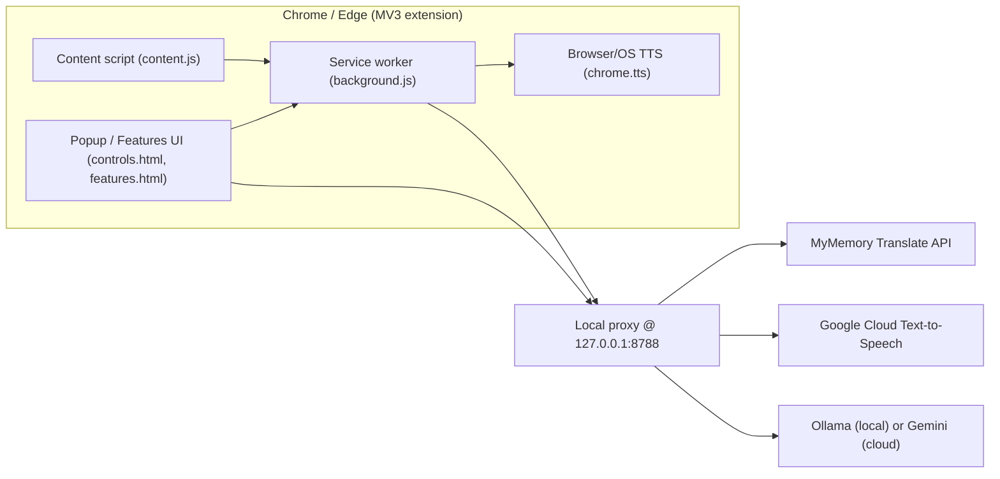

# Translator (OversætMig)

Chrome/Edge translation helper extension (**`translator-ui/`**) with a local ASP.NET Core proxy (**`translator-proxy/`**) for translation, high-quality TTS, and LLM-powered Danish learning tools.

## What’s inside

- **`translator-ui/`**: MV3 browser extension (UI + content script + background service worker)
  - **Translate** selected text via **local proxy** → MyMemory (`https://api.mymemory.translated.net/`)
  - **Pronunciation** via browser/OS voice (`chrome.tts`) or **local proxy** → Google Cloud Text-to-Speech (recommended)
  - **Verb forms** (Danish): infinitive, meaning, present/past/participle/imperative — calls proxy `POST /verbforms`
  - **Explain**: mini-lesson for a sentence or a highlighted fragment — calls proxy `POST /explain`
  - Features live in the extension popup (**Features** section) or a separate **Features** window
- **`translator-proxy/`**: ASP.NET Core (net8.0) Web API on `http://127.0.0.1:8788`:
  - `POST /translate/mymemory` — MyMemory translation
  - `POST /verbforms` — Danish verb forms (LLM: Ollama or Gemini)
  - `POST /explain` — phrase/sentence explanation (LLM: Ollama or Gemini)
  - `POST /tts` — Google Cloud Text-to-Speech
  - `GET /health` — health check

For extension internals (message flow, modules, debugging), see `translator-ui/HOW_FE_WORKS.md`. For install/usage of the extension folder alone, see `translator-ui/README.md`.

## Architecture


```mermaid
flowchart LR
  subgraph Browser["Chrome / Edge (MV3 extension)"]
    UI["Popup / Features UI (controls.html, features.html)"]
    CS["Content script (content.js)"]
    BG["Service worker (background.js)"]
    TTS["Browser/OS TTS (chrome.tts)"]
  end

  MyMemory["MyMemory Translate API"]
  Proxy["Local proxy @ 127.0.0.1:8788"]
  Google["Google Cloud Text-to-Speech"]
  LLM["Ollama (local) or Gemini (cloud)"]

  UI --> BG
  UI --> Proxy
  CS --> BG
  BG --> Proxy
  BG --> TTS
  Proxy --> MyMemory
  Proxy --> Google
  Proxy --> LLM
```

**Request routing**

| User action | Extension path | Proxy endpoint |
|-------------|----------------|----------------|
| Select text → hold → translate | content script → background message → proxy | `POST /translate/mymemory` |
| Context menu “Translate selection” | background → proxy + result window | `POST /translate/mymemory` |
| Speaker button | background → proxy or `chrome.tts` | `POST /tts` (proxy mode) |
| Verb forms / Explain buttons | popup `fetch` directly to proxy | `POST /verbforms`, `POST /explain` |

Translation and TTS go through the **background service worker**. Verb forms and Explain are **direct HTTP calls** from the popup UI to the proxy (no background relay).

## Quick start

### 1) Load the extension (unpacked)

1. Open extensions page:
   - Chrome: `chrome://extensions`
   - Edge: `edge://extensions`
2. Enable **Developer mode**
3. Click **Load unpacked**
4. Select folder: **`translator-ui/`** (the one that contains `manifest.json`)

### 2) (Recommended) Run the local TTS proxy

The extension expects a local proxy at `http://127.0.0.1:8788`:

- Translation: `POST /translate/mymemory`
- Verb forms (Danish): `POST /verbforms`
- Explain (Danish tutor): `POST /explain`
- High-quality pronunciation: `POST /tts` (when **Pronunciation voice** is “High quality voice (recommended)”)

LLM features need **Ollama** (default) or **Gemini** configured on the proxy — see [Notes on secrets](#notes-on-secrets) below.

#### Option A — .NET proxy (recommended)

1. Put your API keys into `translator-proxy/appsettings.Development.local.json` (this filename is already in `.gitignore`).

   **Default LLM provider is Ollama (local).** Install [Ollama](https://ollama.com), pull a model, and keep it running:

   ```powershell
   ollama pull qwen2.5:7b
   ```

   On Windows the Ollama app runs in the background (you do not need `ollama serve`).

   Minimal config (TTS key only; Ollama uses defaults from `appsettings.json`):

```json
{
  "Tts": {
    "Google": {
      "ApiKey": "YOUR_KEY_HERE"
    }
  }
}
```

   To use **Gemini** instead, set `"Llm": { "Provider": "Gemini" }` and add a Gemini API key:

```json
{
  "Llm": { "Provider": "Gemini" },
  "Tts": {
    "Google": {
      "ApiKey": "YOUR_KEY_HERE"
    }
  },
  "Gemini": {
    "ApiKey": "YOUR_KEY_HERE",
    "Model": "gemini-2.5-flash-lite",
    "GenerateContentBaseUrl": "https://generativelanguage.googleapis.com/v1/models",
    "EnableApiVersionFallback": true
  }
}
```

2. Run:

```powershell
cd .\translator-proxy
dotnet run
```

Health check: `GET http://127.0.0.1:8788/health`

#### Option B — Docker Compose

1. Copy `.env.example` to `.env` and fill:

```ini
# Google Cloud Text-to-Speech (proxy `/tts`)
Tts__Google__ApiKey=YOUR_KEY_HERE

# LLM provider: Ollama (default) or Gemini
Llm__Provider=Ollama
Ollama__BaseUrl=http://127.0.0.1:11434
Ollama__Model=qwen2.5:7b

# Gemini (only when Llm__Provider=Gemini)
# Gemini__ApiKey=YOUR_KEY_HERE
# Gemini__Model=gemini-2.5-flash-lite
# Gemini__GenerateContentBaseUrl=https://generativelanguage.googleapis.com/v1/models
# Gemini__EnableApiVersionFallback=true

PORT=8788
```

Before starting the proxy with Ollama: `ollama pull qwen2.5:7b` (or your `Ollama__Model`) and ensure the Ollama app is running.

2. Start the proxy:

```powershell
docker compose up -d --build
```

Health check: `GET http://127.0.0.1:8788/health`

### 3) Use LLM features in the extension

1. Open the extension popup (toolbar icon).
2. Expand **Features**.
3. **Verb forms**: enter a Danish verb or phrase (e.g. `at spise` or `spiser`) → **Get verb forms**.
4. **Explain**:
   - **Sentence**: full sentence (e.g. `Det kan jeg godt, men ikke i dag.`)
   - **Part to explain** (optional): highlight within the sentence (e.g. `det kan jeg godt`). Leave empty to explain the whole sentence.
   - **Source lang** / **Explain in**: optional; defaults to your “Translate from” language and `en`.
5. Use **Open Features in a window** if the popup feels cramped (`features.html`).

First LLM request after idle can be slow (especially with local Ollama).

## Proxy API (quick reference)

All responses are JSON. Successful responses always include `ok: true`; errors include `ok: false` and `error`.

### `POST /translate/mymemory`

- Request:
  - `text` (required, max 500 chars)
  - `source` (required, e.g. `"da"`)
  - `target` (required, e.g. `"en"`)
  - `email` (optional; passed to MyMemory as `de=...`)
- Response (ok): `{ "ok": true, "translatedText": "..." }`

### `POST /verbforms` (Danish verb forms)

Backed by the configured LLM provider (`Llm:Provider` = `Ollama` or `Gemini`). Route name is historical; it is not Gemini-only.

- Request:
  - `text` (required, max 120 chars) — verb, infinitive (`at spise`), or conjugated form; proxy returns dictionary infinitive without `at`
  - `meaningIn` (optional, default `"en"`) — language for the gloss
- Response (ok): `infinitive`, `meaning`, `present`, `past`, `pastParticiple`, `imperative`

Example:

```powershell
curl -Method POST "http://127.0.0.1:8788/verbforms" `
  -ContentType "application/json" `
  -Body '{"text":"at spise","meaningIn":"en"}'
```

### `POST /explain` (Explain a sentence or fragment)

Backed by the same LLM provider as verb forms.

- Request:
  - `text` (required, max 500 chars) — **full sentence**
  - `context` (optional, max 2000 chars) — **part to explain** within the sentence; omit or leave empty to explain the whole sentence
  - `sourceLang` (optional, e.g. `"da"`)
  - `explainIn` (optional, defaults to `"en"`)
- Response (ok):
  - `meta`: `{ sentence, fragment, explainIn }`
  - `sentenceTranslation`, `translation` (gloss of the part), `inYourSentence`, `whenUsed`, `whyDifferent`
  - `examples`: array of `{ source, meaning, context? }`

Example:

```powershell
curl -Method POST "http://127.0.0.1:8788/explain" `
  -ContentType "application/json" `
  -Body '{"text":"Det kan jeg godt, men ikke i dag.","context":"det kan jeg godt","sourceLang":"da","explainIn":"en"}'
```

### `POST /tts`

- Request:
  - `text` (required, max 500 chars)
  - `languageCode` (optional, e.g. `"da-DK"`)
  - `voiceName` (optional, e.g. `"da-DK-Neural2-D"`)
  - `speakingRate` (optional)
  - `pitch` (optional)
- Response (ok): `{ "ok": true, "audio": { "mimeType": "audio/mpeg", "base64": "..." } }`

## Auto-start after reboot (Windows)

If you run the proxy via Docker, you can have it come back automatically after a restart:

1. Make sure **Docker Desktop** is set to **start on login**.
2. One-time: register a scheduled task (runs on your login and calls `start-translator.ps1`):

```powershell
.\scripts\register-startup-task.ps1
```

What this does:

- Creates/updates a Windows Scheduled Task named `Translator - start docker compose`
- Trigger: on your next login (with a small delay)
- Action: runs `.\scripts\start-translator.ps1`, which waits for Docker and then runs `docker compose up -d`
- Note: this is a **start/ensure-running** flow; it does **not** force recreation like `rebuild.cmd` (`--force-recreate`)
- The task is registered with **limited privileges** by default (no admin required). If you need highest privileges, run PowerShell as Administrator and use:

```powershell
.\scripts\register-startup-task.ps1 -RunLevel Highest
```

Verify the task exists:

```powershell
schtasks /Query /TN "Translator - start docker compose"
```

Logs go to: `%LOCALAPPDATA%\translator\logs\startup.log`

To remove the task later, run `.\scripts\unregister-startup-task.ps1`:

```powershell
.\scripts\unregister-startup-task.ps1
```

## Build a new Docker image on `git push` (local)

If you want a **local** “build on push” flow, you can use a Git `pre-push` hook. This runs **on your machine** right before the push is sent.

Required one-time setup (per repo clone): run `git config core.hooksPath .githooks` (hooks are local, so each machine/clone must do this once).

```powershell
git config core.hooksPath .githooks
```

Verify it’s enabled:

```powershell
git config --get core.hooksPath
```

Sanity check (make sure Git can see the hook file):

```powershell
type .\.githooks\pre-push
```

What happens:

- When you push `master` or `main`, the `pre-push` hook rebuilds the compose stack:
  - runs `docker compose build --pull`
  - recreates containers with `docker compose up -d --force-recreate` (brief local downtime)
  - cleans dangling images with `docker image prune -f`

How to confirm it ran:

- Run `git push origin master` (or `main`) and look for these lines:
  - `=== Building images (pull latest base) ===`
  - `=== Recreating containers with new image ===`
  - `=== Cleaning dangling images ===`

Skip the hook for one push (if you’re in a hurry):

```powershell
git push --no-verify
```

Quick reference:

- How to verify it: `git config --get core.hooksPath`
- How to skip once: `git push --no-verify`

Optional publishing:

- If you want to publish images to a registry instead of (or in addition to) rebuilding the local compose stack, switch the hook to run `scripts/build-translator-proxy-image.ps1 -Push` and set `DOCKER_REGISTRY` / `TRANSLATOR_PROXY_IMAGE`.

## Notes on secrets

- The proxy reads Google TTS key from `Tts:Google:ApiKey` (env var: `Tts__Google__ApiKey`). For backward compatibility it also accepts `GOOGLE_TTS_API_KEY`.
- **LLM provider** is selected via `Llm:Provider` (env var: `Llm__Provider`). Default: `Ollama`.
- **Ollama** (local, no API key required):
  - `Ollama:BaseUrl` (env var: `Ollama__BaseUrl`) default: `http://127.0.0.1:11434`
  - `Ollama:Model` (env var: `Ollama__Model`) default: `qwen2.5:7b` (first request after idle can be slow; use a larger model if you have VRAM headroom)
  - Endpoints `/verbforms` and `/explain` call Ollama’s OpenAI-compatible `/v1/chat/completions` when the provider is Ollama.
  - **Ollama accuracy:** local models can still get Danish verb forms wrong; for reliable results set `Llm:Provider` to `Gemini`. Smaller/faster local models: `qwen2.5:3b` via `Ollama__Model`. Optional Windows env `OLLAMA_KEEP_ALIVE=30m` (restart Ollama) to reduce cold-start delays.
  - Prompts for `/verbforms` and `/explain` are configurable under `Ollama:VerbForms`, `Ollama:Explain`, `Gemini:VerbForms`, and `Gemini:Explain` in `appsettings.json`.
  - **Visual Studio:** stop Docker on port 8788, F5 `translator-proxy`; extension uses `http://127.0.0.1:8788`.
- **Gemini** (cloud): set `Llm:Provider` to `Gemini` and configure:
  - `Gemini:ApiKey` (env var: `Gemini__ApiKey`). For backward compatibility it also accepts `GEMINI_API_KEY`.
- Gemini settings:
  - `Gemini:Model` (env var: `Gemini__Model`) default: `gemini-2.5-flash-lite`
  - `Gemini:GenerateContentBaseUrl` (env var: `Gemini__GenerateContentBaseUrl`) default: `https://generativelanguage.googleapis.com/v1/models`
  - `Gemini:EnableApiVersionFallback` (env var: `Gemini__EnableApiVersionFallback`) default: `true` (retries once with `v1` ↔ `v1beta` on 404, and on certain 400 errors when the endpoint rejects JSON-mode fields)
- You can create a free Gemini key in Google AI Studio (no credit card): `https://aistudio.google.com/app/apikey`
- Keep keys in `appsettings.Development.local.json` (or env vars). Avoid committing keys into `appsettings.json`.

